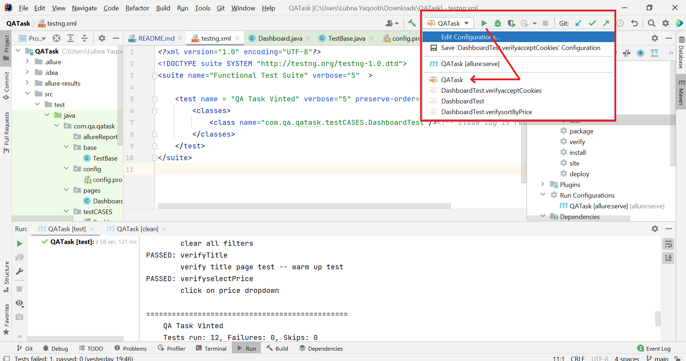

# Tech Challenge

Implementation /verification of Vinted e-commerce website test cases 
## Installation

Use a JDK 16 and Eclipse to implement this project 
* Steps to run this prject
```
Install JDK 16.02
Install  IntelliJ
```

* Plugins Required : if IntelliJ does not auto support plugins, please install 
```
Allure Report Plugin
Test-It Allure Annotations
```


The maven project is built with```Pom.xml```  that contains all the dependencies run the program
* TestNG library is to use because Annotations are easy to understand, also it allows executing test cases based on group which isn't possible in JUnit
* configurations for change browser or url is placed in config file located on the path ``src/test/java/com/qa/qatask/config/config.properties``


## Execute Program 
To execute or run the program as testng test suite, click on the sidebar and at the first step install all the dependencies add in pom.xml to run the project,
As shown in the image, at the second step, compile and test it with play button, 
and it will display all the test case result in the terminal below. 

To Run it as a test suite, using ``testng.xml`` file, use the image below that is marked with arrow as a QA task in the image below. 




## Allure Reporting

* To generate allure report, we have to first install Allure command line application. (I have done this for windows application, but it might be different for mac or linux OS)

* Run below command from your PowerShell to install scoop to its default location
  `````(C:\Users\\scoop)`````
* One of the easiest way to start PowerShell in Windows, is using Run window. Press Win + R keys on your keyboard, then type powershell and press Enter or click OK. ``iex (new-object net.webclient).downloadstring('https://get.scoop.sh')``
* To install Allure, using Scoop, run the below command  ``scoop install allure``
* Now, open command prompt, navigate to the project directory, and run tests using command `` mvn clean test
  ``
* Lastly run the command `` allure serve``to generate allure reports


## Questions or Suggestions
Feel free to send me the questions or suggestion at my email address.
lubnayaqoob@gmail.com